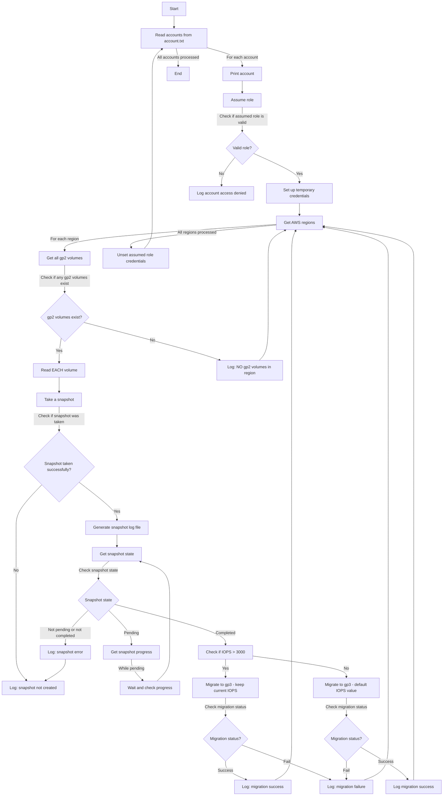

# AWS EBS Volume Migration from gp2 to gp3

This repository contains the code to migrate AWS EBS volumes from gp2 to gp3. 

By migrating to gp3, we can save up to 20% lower price-point per GB than existing gp2 volumes.

## The Tool

This bash script will read the file _account.txt_ **which must contain all AWS accounts with the volumes to be migrated**. _The script was created this way due to the necessity of splitting the accounts to be migrated in 3 differente phases._

**Make sure the accounts.txt file is created in the same path the script will be executed.**

It will run over each region on all accounts (mentioned on the account.txt) searching for gp2 volumes.

For each found volume, a snapshot will be taken.

If snapshot completes successfully, the migrations starts.

Then it checks IOPS value. If its grater than 3000, the volume is migrated with the current IOPS value.

## Diagram

## Flow chart

 

## Tool Execution

## Logs

The tool generates three logs.

1. Snapshot taken before before migration. 
It will show account ID, region, volume ID and snapshot ID.

2. Volumes migrated.
It will show account ID, region and volume ID.

3. Full log during execution.
