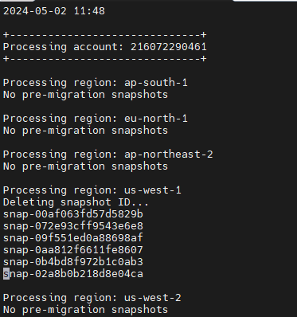

# Delete Snapshots Created Pre-Migration

This repository contains the code to delete all snapshots created as a backup before executing the migration. 

## The Tool

This bash script will look for all snapshots that contain the description "Migrate gp2 to gp3", and then delete it.

A full log will be created showing all snapshots ID deleted.

## Logs

The tool generates a full log.

